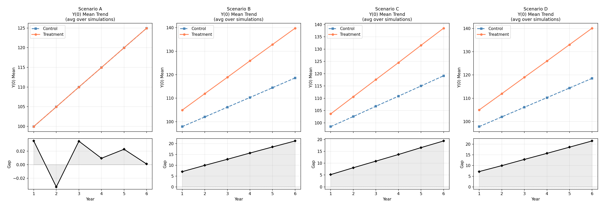
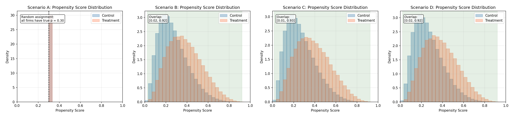

# 任务一自检报告

生成时间：2026-05-09 19:26:30
模拟次数：1000 企业 × 6 年 × 500 次
处理效应说明：场景 A/B/C 为常数 τ = 50.0
场景 D 为异质处理效应：τ_i = 50 + 8 * clip(X_i, -1.5, 1.5)

## 1. 处理组占比检查

| 场景 | 平均处理率               | 标准差                  | 最小    | 最大    | 验收 |
| -- | ------------------- | -------------------- | ----- | ----- | -- |
| A  | 0.2996399999999999  | 0.013499884954605178 | 0.261 | 0.339 | ✓  |
| B  | 0.302636            | 0.01572813569705609  | 0.252 | 0.352 | ✓  |
| C  | 0.30449             | 0.015163699270003425 | 0.25  | 0.347 | ✓  |
| D  | 0.30169999999999997 | 0.014467502107636586 | 0.257 | 0.341 | ✓  |

> 验收标准：500 次平均处理率落在 [0.28, 0.32] 区间

## 2. Y(0) 组均值趋势图

## 3. 倾向得分分布（全部场景）

## 4. 随机种子与复现说明

- 场景 A：`seed = 1000 + sim_id`
- 场景 B：`seed = 2000 + sim_id`
- 场景 C：`seed = 3000 + sim_id`
- 场景 D：`seed = 4000 + sim_id`
- 每次循环内部创建独立 RNG，不依赖全局状态

## 5. 正式交付数据字段

| 字段 | 说明 |
| :--- | :--- |
| scenario | 场景标签（A / B / C / D） |
| sim_id | 模拟编号 1-500 |
| firm_id | 企业编号 0-999 |
| year | 年份 1-6 |
| post | 处理后指示变量（t≥4 时为 1） |
| D | 处理分配（1=处理组，0=控制组） |
| X | 处理前协变量（企业初始规模 ~ N(0,1)） |
| Y | 观测结果（万元） |

正式交付数据**不含** U_i、Y0、Y1 等调试字段。