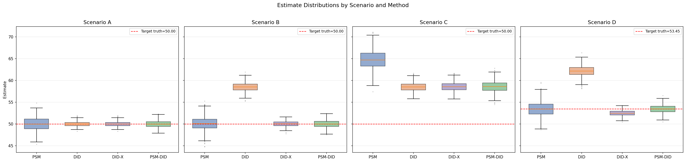
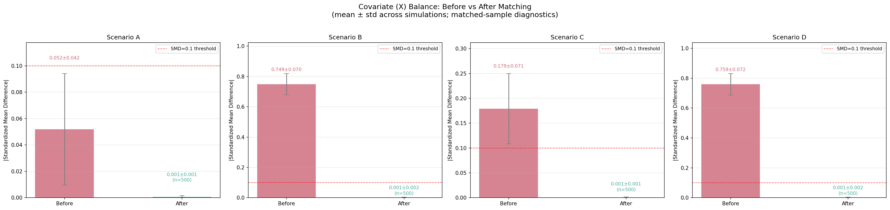
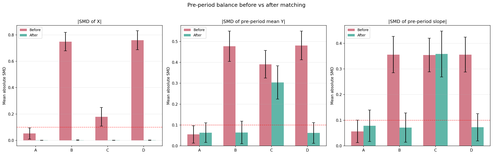
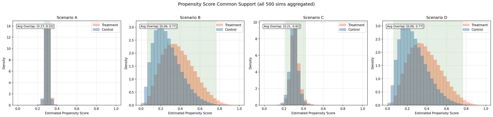

# 研究报告：用 Monte Carlo 模拟理解 PSM-DID

## 一、问题背景

我设定了本研究的问题背景为：某地区在第 4 年初实施了更严格的环境监管政策，将部分企业纳入重点监管名单。研究者希望使用企业面板数据，评估这一政策对企业绿色技术投资额的因果影响。
A 场景是理想场景，监管名单选取的企业近似随机，两组无政策趋势平行。
B 场景是可观测选择，企业规模 `X_i` 同时影响被监管概率和无政策时绿色投资增长趋势。
C 场景是不可观测选择，真正影响监管选择和投资趋势的是研究者看不见的 `U_i`，即管理层环保偏好。
此外，为了进一步讨论估计对象更接近 `ATE` 还是 `ATT`，在 B 的基础上加入异质处理效应，即 D 场景，企业规模 `X_i` 会影响其被监管后的绿色投资增长效果。

## 二、模拟设计

我选择采用企业平衡面板：1000 家企业、6 期观测，政策从第 4 期开始，前 3 期用于检查处理前趋势。每个场景重复 500 次。

场景设定上，如图 1 所示，A/B/C 的真实处理效应设为常数 τ = 50；扩展场景 D 则引入异质处理效应，具体设定为 τ_i = 50 + 8 × clip(X_i, -1.5, 1.5)。

方法设定上，DID 直接在全样本 6 期面板上估计双向固定效应模型，以 D_i × post_t 的系数作为处理效应；DID-X 在此基础上加入 X_i × s_t 交互项，用来吸收由可观测协变量驱动的线性趋势异质性。PSM 先在企业层面用处理前协变量 X_i 估计倾向得分，具体采用带截距的 Logit 回归；随后按共同支持区间裁剪样本，并实施 1:1 最近邻、放回匹配。PSM 的估计值是在匹配样本上直接比较处理组与控制组的处理后结果水平。PSM-DID 则与 PSM 共用同一套倾向得分、共同支持筛选和匹配结果，但不直接比较处理后水平，而是把匹配到的企业重新还原为完整面板，再在匹配样本上估计双向固定效应 DID。

图 1  四个场景下未处理潜在结果趋势

## 三、结果展示

| 场景 | 方法 | 真值目标 | 平均估计 | Bias | RMSE |
|:--:|:--:|--:|--:|--:|--:|
| A | DID | 50.000 | 49.999 | -0.001 | 0.544 |
| A | DID-X | 50.000 | 49.999 | -0.001 | 0.544 |
| A | PSM | 50.000 | 49.989 | -0.011 | 1.527 |
| A | PSM-DID | 50.000 | 49.996 | -0.004 | 0.777 |
| B | DID | 50.000 | 58.507 | +8.507 | 8.566 |
| B | DID-X | 50.000 | 50.021 | +0.021 | 0.624 |
| B | PSM | 50.000 | 50.068 | +0.068 | 1.725 |
| B | PSM-DID | 50.000 | 49.998 | -0.002 | 0.877 |
| C | DID | 50.000 | 58.489 | +8.489 | 8.546 |
| C | DID-X | 50.000 | 58.529 | +8.529 | 8.587 |
| C | PSM | 50.000 | 64.797 | +14.797 | 14.974 |
| C | PSM-DID | 50.000 | 58.576 | +8.576 | 8.679 |
| D | DID | 53.504 | 62.118 | +8.613 | 8.667 |
| D | DID-X | 53.504 | 52.456 | -1.048 | 1.207 |
| D | PSM | 53.402 | 53.417 | +0.016 | 1.719 |
| D | PSM-DID | 53.402 | 53.431 | +0.030 | 0.856 |

表 1  Monte Carlo 估计结果汇总

图 2  不同场景与方法下的估计值分布

首先是各方法的模拟效果总览，如表 1 和图 2 所示：
场景 A 中，DID、DID-X 和 PSM-DID 都接近真值，说明在无条件平行趋势成立时，DID 已经足够，额外匹配不是识别所必需。
场景 B 中，未匹配 DID 的 Bias 达到 +8.507，而 PSM-DID 和 DID-X 都回到接近 0 的范围，说明这里的问题不是政策效应本身难以识别，而是基础 DID 错把由 `X_i` 驱动的原有趋势差异当成了政策效应。
场景 C 中，DID、DID-X 和 PSM-DID 都仍然明显上偏，说明一旦趋势差异来自不可观测 `U_i`，单纯平衡 `X_i` 无法恢复正确反事实。
扩展场景 D 则表明，在识别结构仍与 B 相同、但处理效应变为异质后，PSM-DID 的估计值更接近匹配后处理组的 `ATT=53.402`，而不是总体 `ATE≈50.004`。

| 场景 | 样本 | \|SMD(X)\| | \|SMD(斜率)\| | placebo DID | pretrend |
|:--:|:--:|--:|--:|--:|--:|
| A | 匹配前 | 0.052 | 0.057 | +0.034 | -0.000 |
| A | 匹配后 | 0.001 | 0.079 | +0.024 | -0.007 |
| B | 匹配前 | 0.749 | 0.356 | +4.251 | +2.851 |
| B | 匹配后 | 0.001 | 0.072 | +0.014 | +0.034 |
| C | 匹配前 | 0.179 | 0.354 | +4.228 | +2.836 |
| C | 匹配后 | 0.001 | 0.358 | +4.276 | +2.865 |
| D | 匹配前 | 0.759 | 0.356 | +4.298 | +2.843 |
| D | 匹配后 | 0.001 | 0.073 | -0.037 | -0.046 |

表 2  匹配前后的识别诊断

图 3  匹配前后的协变量平衡情况

图 4  匹配前后的处理前结果与趋势诊断

匹配的效果呈现得很清楚。在 B 中，匹配后 `|SMD(X)|` 从 0.749 降到 0.001，placebo DID 从 +4.251 降到 +0.014，pretrend 从 +2.851 降到 +0.034，处理前趋势差异基本被修复，因此 PSM-DID 能够恢复条件平行趋势。可是在 C 中，虽然 `X` 同样被平衡，`|SMD(X)|` 也降到了 0.001，但处理前斜率、placebo DID 和 pretrend 几乎没有改善，这说明真正驱动趋势差异的是研究者看不见的 `U_i`，而不是 `X_i`，识别条件本身不成立。

图 5  倾向得分共同支持情况

最后再看共同支持。本模拟没有共同支持失败，但 A 有 12.6% 极窄支持警告，C 有 0.6%。因此，主要偏误来自于趋势识别条件不成立而非共同支持失败。

## 四、理论解释

第一，当处理选择只由可观测协变量决定时，PSM 为什么可能有效？

核心原因在于 PSM 有助于在可观测协变量上实现可比性。场景 B 中，企业是否被监管、以及无政策时绿色投资增长更快，都由 `X_i` 驱动。因此在 `X_i` 上匹配后，控制组更接近处理组的反事实状态。B 的 `|SMD(X)|` 从 0.749 降到 0.001，PSM-DID 的 Bias 从 DID 的 +8.507 降到 -0.002。

第二，当存在时间不变的未观测异质性时，DID 为什么可能有效？

核心原因是 DID 的有效性在于无政策趋势相同。所以，即便存在时间不变的未观测异质性，前后差分可以把它们消去。例如，A 中 DID 的 Bias 为 -0.001，RMSE 为 0.544，说明平行趋势成立时，DID 能用控制组变化刻画处理组反事实变化。

第三，当趋势差异依赖于 `X_i` 时，为什么 PSM-DID 可能优于未匹配 DID？
理由是，在场景 B 设定下，处理组 `X_i` 更高，无政策时本来就增长更快。此时，未匹配 DID 把因企业规模产生的绿色投资原有增长错当成政策效果，产生 +8.507 的偏误。但是，PSM-DID 通过匹配再做 DID 有效控制了可观测协变量 `X_i` 带来的偏误；为了补充验证，我额外做的 DID-X 这种方法在 B 中也接近无偏，说明问题不是 DID 形式本身，而是基础 DID 没处理 `X_i` 驱动的趋势差异。

第四，当存在时间变化的未观测混淆时，为什么 PSM-DID 仍然可能失败？
场景 C 中，匹配后 `X_i` 已平衡，但 Bias 仍为 +8.576。原因是不可观测 `U_i` 同时影响处理分配和增长趋势。PSM 只能平衡观测变量，DID 只能处理稳定差异；若遗漏变量造成趋势差异，两者叠加依旧可能失败。

第五，匹配会改变估计对象吗？
在前三类场景给定固定处理效应下，ATT 等于 ATE，这个问题无法验证。所以，我增设了异质处理效应的场景 D，答案是会。D 中处理效应随 `X_i` 上升，而处理组平均 `X_i` 更高，所以 `ATT≈53.504` 高于 `ATE≈50.004`。PSM-DID 的 53.431 更接近匹配后处理组 `ATT=53.402`。

第六，共同支持不足为什么会同时恶化偏误和方差？
原因就是如果处理组找不到相近对象，匹配只能依赖边界样本、重复使用少数控制组，甚至裁剪处理组。例如，场景 A 的平均支持宽度仅为 0.0564，极窄区间比例达到 12.6%，相比之下，场景 B 和 D 的平均支持宽度分别约为 0.6799 和 0.6826，重叠明显更好，其较好表现也与在较好共同支持下恢复了条件平行趋势有关。

## 五、文献评价

### 5.1 研究问题和处理变量

我选择评价逯进、赵亚楠、苏妍的《“文明城市”评选与环境污染治理：一项准自然实验》（《财经研究》，2020 年第 4 期，DOI：10.16538/j.cnki.jfe.2020.04.008）。
该文基于 2003-2016 年 228 个地级市数据，研究“文明城市”评选是否降低环境污染。处理变量是是否入选“文明城市”，59 个入选地级市为实验组，其他城市为对照组；结果变量包括 `lnPM2.5`、`lnSO2`、`lnSmoke` 和 `lnWater`。

### 5.2 为什么使用 PSM-DID

作者担心的是处理组和对照组，即“文明城市”的入选城市与非入选城市，在政策实施前存在系统性差异，尤其是治理能力、经济发展、绿化、公共交通和消费等层面的差异。
在方法选取上，由于文明城市并非随机授予，只用 DID，组间可能不可比；只用 PSM，则不能利用政策前后变化。

### 5.3 匹配变量是否处理前

论文用财政支出占 GDP 比重、人均 GDP、人均绿地面积、公交车数量和消费总额对数估计倾向得分，变量选择有一定合理性。
但是，论文未明确报告匹配协变量全部为处理前变量这一点，更像是直接使用了面板中的控制变量，这一点存疑。

### 5.4 共同支持和平衡性检验

论文报告了匹配后 t 检验和标准化偏差，匹配后各协变量 t 值不显著，标准偏差绝对值小于 20%，说明做了平衡性检验。
但是，论文没有共同支持的具体说明，未见单列展示共同支持图，这一点存疑。

### 5.5 平行趋势是否可信，作者如何检验

这篇论文没有给出标准的平行趋势图、事件研究图，作者用提前一年、提前两年的反事实检验支持平行趋势。作者以 2007 年为假政策时，lnPM2.5 的假政策系数为 0.3554，其他三类污染物不显著。作者将其总体解释为基准结果可靠，但至少对 PM2.5 而言，2007 年 placebo 已经提示可能存在差异趋势或其他未控制冲击。
所以，我的判断是论文提供了一定支持，但平行趋势证据并不充分，尤其 PM2.5 存在不利信号。

### 5.6 时间变化混淆和同期政策

这篇论文对同期政策的控制是一大亮点，作者明确意识到并发政策会污染 DID 估计，因此控制了三个同时期、且理论上会影响污染排放的重要政策/法规（“低碳城市”“智慧城市”和 2014 年《环境保护法》）。作者将三者作为额外政策变量纳入模型后，发现“文明城市”评选的 DID 系数仍然显著为负，因此认为基准回归结论并非完全由这些政策替代解释。
不过，论文对未观测且随时间变化的混淆因素处理得还不够彻底，没有处理城市特定线性趋势、事件研究等因素，诸如城市领导更替带来的环保投入变化这类潜在威胁依然存在。

### 5.7 ATE 还是 ATT

该文估计结果更接近 `ATT`，而不是 `ATE`，因为 PSM-DID 在匹配后的入选城市及相似对照城市中估计效应，回答的是评选对实际入选城市的影响，而非所有城市若都入选的平均影响。

### 5.8 结合模拟经验评估论文识别策略不同条件下的可信性和脆弱性
该文的识别策略依赖三步：把“文明城市”评选看作外生政策冲击，用 PSM 构造可比对照组，再用 DID 识别政策前后差异。可信性条件包括：第一，入选“文明城市”的差异主要来自可观测的城市特征；第二，这些特征被用于匹配，且匹配后实验组和对照组具有充分共同支持；第三，匹配后两组城市在政策前的污染变化趋势基本一致。
脆弱性条件包括：第一，影响入选和污染趋势的是难以观测的因素，例如官员晋升压力、地方执行力，则 PSM 匹配样本难以比较；第二，“文明城市”评选并非真正随机，处理组可能在获评前就已走上不同趋势；第三，同期存在高度相关政策，DID 依赖匹配后的平行趋势，此时估计结果偏差可能较大。

## 六、结论

通过四个 Monte Carlo 场景的比较，我理解到了 PSM-DID 的价值与应用场景。PSM-DID 先用处理前可观测变量匹配相似样本，再用 DID 比较前后变化，当处理选择主要来自可观测差异时，可以提高处理组和控制组的可比性，并消除时间不变差异。其局限在于未观测差异场景下匹配后如果趋势仍不平行估计结果就不可靠，因此更适用于处理组和控制组存在可观测差异、且匹配后能够满足条件平行趋势的政策评估场景。

注：研究全过程使用了 Claude Code、Codex 等工具辅助写代码、调试和整理文本，具体见 [AI工具使用记录.md](AI工具使用记录.md)。
